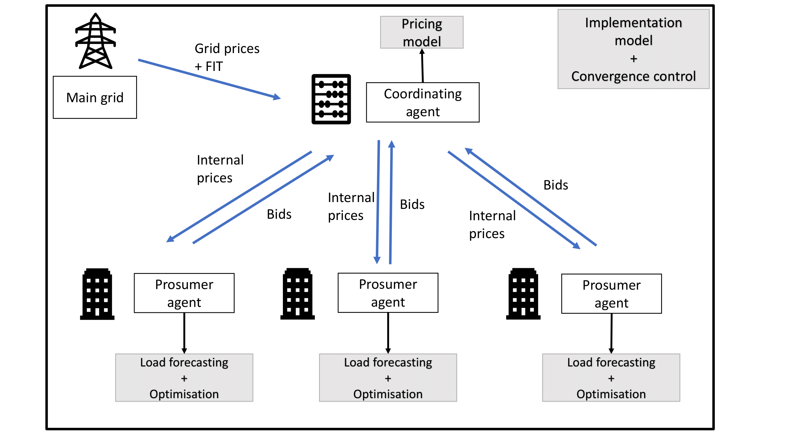
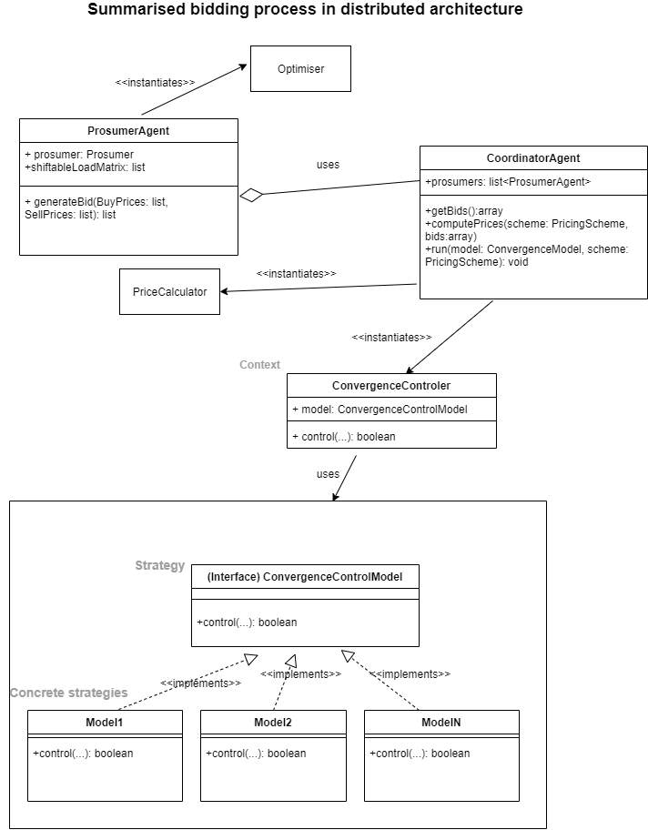
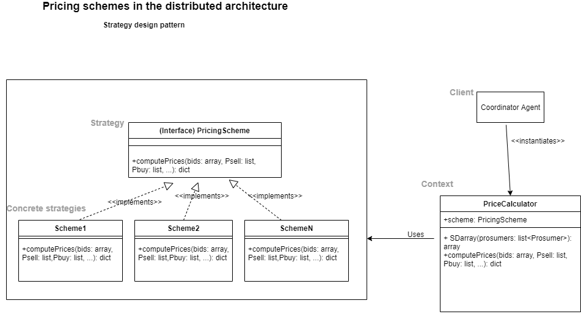
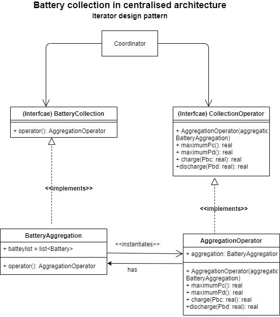
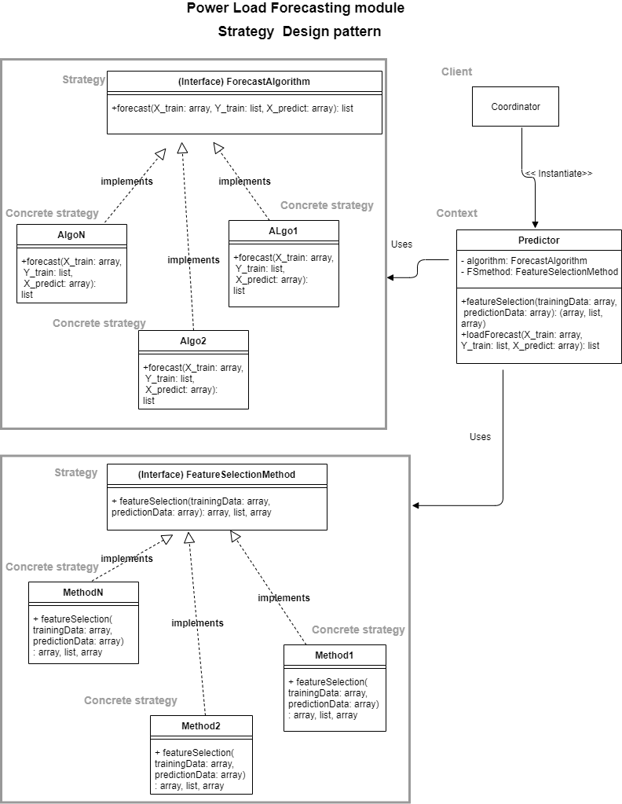

# P2P Energy Sharing simulation 

design and development:
- [Rima Oulhaj](https://gitlab.com/rimaoulhaj)
- [Alex Gabriel](https://github.com/gabriel-alex)

supervised by:
- Alex Gabriel
- Laurent Dupont 

## Description 
Compare centralized and distributed optimisation approach for energy sharing/trading in a microgrid. 

### Data used
Information concerning tariff can be found on [data.gouv.fr](https://www.data.gouv.fr/fr/datasets/arretes-tarifaires-photovoltaiques-en-metropole/) or [photovoltaique.info](https://www.photovoltaique.info/fr/tarifs-dachat-et-autoconsommation/tarifs-dachat/arrete-tarifaire-en-vigueur/). In the case of saling surplus to inject it in the grid, the price is 0.10€/kWh.



## Set up the projet

This procedure to experiment the projet suppose you already have installed Python3 on your computer and you are quite familiar with virtual environment in Python.

```bash 
python3 -m venv .
source bin/activate #on Linux environment 
pip3 install -r requirements.txt
```

## Sorftware achitecture 






